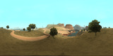
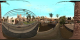

# Панорамы в GTA: San Andreas


Проект сделан по мотивам проекта panorama-3dsmax и пытается повторить следующие проекты:
* https://play.gtasaguesser.com/panorama
* https://lostgamer.io/singleplayer/gta-sa/full-map

# Примеры

[](./Samples/pano_4k.png)
[](./Samples/pano-10-128x96.png)
[](./Samples/pano-20-128x96.png)
[](./Samples/pano2.png)
[](./Samples/pano3.png)
[](./Samples/pano4.png)
[](./Samples/pano5.png)
[](./Samples/pano.png)

# Сборка и подготовка

Проект изначально собирается на linux-машине и кросс-компилируется под win32, потому наличие пакета `gcc-mingw-w64-i686` крайне приветствуется, равно как и `make` и все такое прочее.

Сборка проекта крайне проста:
```
# make
```

На выходе получаем файл `panorama.asi`, который надо закинуть в директорию с игрой. Само собой, должен быть установлен лоадер, который будет это читать, к примеру, из комплекта CLEO.

Далее, нам понадобится внешний скриншотер, я использую Greenshot, который настроен таким образом, что по нажатию ALT+PRINTSCREEN сохраняет файл в формате PNG в директорию "T:\GTA-trains\Screenshots\" (все пути захардкожены, см.далее). Утилита симулирует нажатие ALT+PRINTSCREEN в те моменты, когда сформировывается изображение на экране.

# Использование

Клавиши управления:
* `F6` - Поменять цикл времени, возможна смена погоды
* `F7` - Начать/остановить процедуру снятия панорамы
* `F8` - Перелететь в какое-то красивое место
* `F9` - Перелететь в случайное место
* `F10` - Поменять погоду на случайную

Дополнительные функции:
* `F4` - Попробовать зафризить время, анимации, погоду
* `F5` - Прилететь к нефтяному заводу и установить ветренную погоду (для отладки остановки времени/анимаций/движения деревьев от ветра)
* `F11` - Поменять параметры освещения. Работает некорректно, на долю секунды меняются цвета и возвращаются, зато автомобили можно перекрасить в розовый или зеленый цвет. А я хотел здания и небо.

Бегаем по игре, в красивом месте нажимаем F7, по захардкоженным путям появляются директории с кучей картинок. В начале сессии все картинки из директории скриншотов (в моем случае это T:\GTA-trains\Screenshots\) удаляются, а по мере добавления, они перетаскиваются в директорию проекта. Там же создается файл pto и bat для сборки утилитой Nona из пакета Hugin.

Чтобы нас в процессе снятия скриншотов не убили/не арестовали, рекомендуется установить CheatMenu и сделать себе бессмертие и иммунитет к полиции.

После начала процесса съемки, с игрой происходит следующее:
* Выставляется FPS в 10 кадров/сек
* Выставляется максимальная дистанция отрисовки (как получилось, думаю можно лучше)
* Выставляется корректный aspect ratio
* Замораживается время по мере возможности (некоторые педы все же продолжают двигаться), погода
* Патчится значение ветра в текущей погоде, ветер выключается.
* Отключаются hud/радар на время съемки. Почти как в `CLEO/nohud.cs`, но сообщения не отключаются

# Дополнительно, но не обязательно

Чтобы получить максимально аутентичные результаты, да и просто для удобства работы, можно докинуть еще следующее:
* `CLEO.asi` - популярная библиотека и лоадер
* `modloader.asi` - загрузчик некоторых дополнительных модов/патчей, чтобы они не конфликтовали, требуется некоторым модам вида `LOD_Vegetation`
* `III.VC.SA.LimitAdjuster.asi` - увеличиваем количество объектов
* `imfast.asi` - скипаем загрузочные экраны и запускаем игру сразу
* `SADisplayResolutions.asi` - добавляем поддержку 1920х1080
* `SALodLights.asi` - Project2Dfx, очень красивое освещение, изменение дистанции отрисовки
* `CLEO/cheats.cs` - популярное CheatMenu, перед созданием панорамы рекомендуется сделать себя бессмертным и no wanted level
* `CLEO/FLY.cs` - полетный скрипт, заберитесь на возвышенность (на автомобиль) и спрыгните, легко искать красивый вид для съемки
* `CLEO/memory512.cs` (или 2048?) - увеличение лимитов для прорисовки
* `CLEO/No_more_haze.cs` - отключения эффекта жары
* `CLEO/nohud.cs` - отключение статы, радара и сообщений на экране

Желательно как-то улучшить дистанцию отрисовки, к примеру через настройки `SALodLights.ini` (установить параметр `MinDrawDistanceOnTheGround = 2000.0`) или поставить какие-то расширения, вроде `LOD_Vegetation`. Всякие RenderHook по вкусу, если они конечно заработают (у меня - нет).
В самой же игре, при начале съемки скриншотов, дистанция отрисовки ставится в 8000.0 при начале сканирования панорамы. В начале же выставляется скорость игры в 10fps, потом восстанавливается.
При начале съемки отключается ветер, потом ветер в игре не восстанавливается.

При желании можно установить множество разных модов для повышения зрелищности:
* https://youtu.be/zwWjyEIpSyo
* https://youtu.be/WebyC1rvChY
* https://youtu.be/EE1bDj3CzAk
* https://youtu.be/BArLeEQrp5I
* https://youtu.be/Pgvvh9mQ1kA

Чтобы гигабайты надампленных картинок хранить было удобнее, их можно сконвертировать в видеофайл примерно таким вот заклинанием:
```
ffmpeg -y -vsync 0 -hwaccel cuda -hwaccel_output_format cuda -i frame-%7d.png -c:v h264_nvenc -b:v 15M panorama-scan.mp4
```
Если же видеокарточки от NVidia нету, то можно и попроще, кодирование процессором:
```
ffmpeg -y -vsync 0 -i frame-%7d.png -b:v 15M panorama-scan.mp4
```

# Как склеить панораму?

Один из важнейших параметров при нарезке панорамы - это FoV (Field of View), или ширина поля (угла) обзора объектива в градусах. Чем меньше угол обзора, тем дальше заглядывает объектив, картинка выглядит более приближенной, такие объективы называют "телевики". Если же объектив широкоугольный, то это позволяет склеить панораму за меньшее количество снимков, но и разрешение будет ниже.

Если в плагине поставить FoV=125.0, то будет создано 45 картинок, общим весом около 100 мегабайт (при разрешении 1920х1080). Если же заниматься крайностями и странным, поставить FoV=5.0, то будет создано уже 23653 картинки, общим весом 5-15 гигабайт. Так как панорамы мне интересны как исследовательский проект, то мне интересны большие датасеты и большие разрешения.

Если у нас небольшой датасет из 30-300 изображений, то можно попробовать просто взять такие пакеты как `Hugin` или `PTGui`, засунуть туда картинки и попробовать себя в деле склейки панорам, даже если на руках нету фотоаппарата, а поклеить панорамки и приобщиться к великому охота. К моему большому удивлению, бесплатный и свободный `Hugin` склеил тестовый датасет на порядок лучше, чем это сделал `PTGui`, однако `PTGui` работает на два порядка быстрее, имеет кучу фич и более дружелюбен к пользователю. В общем, можно обмазаться кучей софта для склейки панорам и тестировать его возможности.

Если датасет большой, то любой "пользовательский" софт дружит с них плохо. Поэтому я пережимаю такие датасеты в маленькие картинки, размером в 128х96, или даже 32х24 пикселя. Рядом же с панорамой создается файл проекта `*.PTO` (для `Hugin`), чтобы софту не приходилось долго анализировать картинку и восстанавливать позицию фотоаппарата, откуда и как был сделан снимок. Тем более, что все равно будут погрешности, а так как фотоаппарат у нас виртуальный, то позицию съемки мы знаем точно.

Итак, первым делом сконвертим наш датасет командой вида:
```
`ffmpeg -i frame-%7d.png -s 128x96 128x96/frame-%7d.jpg`;
```
Или просто запустим `pto-fov.pl`, который может нарезать датасет в несколько размеров. Если не используете мой скрипт, то имейте в виду, что файлы из игры сохраняются с нумерацией от 0, а ffmpeg нумерует их от 1.

Важный момент: игра была расчитана на мониторы 4:3, плагин `SADisplayResolutions.asi` хоть и добавляет поддержку `1920x1080`, но немного растягивает картинку по горизонтали. Именно поэтому ресайз надо делать до `128х96`, а не `128x72`! Иначе можно получить артефакты склейки! Это же относится к попытке склеить оригинальные скриншоты `1920х1080`!

Затем можно запустить утилиту `Nona` из комплекта `Hugin`, склеив все в командной строке:
```
"\Hugin-2023.0.0-win64\nona" -o pano-10-128x96 pano-10-128x96.pto
```
Как вариант, появляющийся PTO-файл можно открыть и в самом `Hugin`, после чего можно покрутить различные параметры. Дефолтные параметры сборки я делал для себя, к примеру, в них нету интерполяции, потому качество картинки не самое высокое.

Среди профессиональных фотографов популярен платный и проприетарный пакет `PTGui`, который не открывает файл PTO, потому рядом есть `PTSgen.pl`, который конвертирует файл `pano.pto` в `pano.pts`. Теперь проект можно открыть в `PTGui`, контрольных точек в нем не будет, но они нам и не нужны - можно сразу пойти на вкладку `Preview` или `Create Panorama` и создать панораму там. Лично мне очень понравилась скорость работы этого пакета и количество фич, такие как маски или редактирование швов склейки. Однако качество панорам у меня в `Hugin` получилось намного лучше, пусть и ценой времени 

# Время для обработки

`Hugin` хоть и делает более красивые картинки, но делает это крайне долго. На датасете 128х96, 23653 картинки (5 градусов), склейка панорамы занимает:

* [pano-32x24-512x256.png](Samples/Compare/pano-32x24-512x256.png) = 7 minutes
* [pano-32x24-1024x512.png](Samples/Compare/pano-32x24-1024x512.png) = 7 minutes
* [pano-32x24-2048x1024.png](Samples/Compare/pano-32x24-2048x1024.png) = 8 minutes
* [pano-32x24-4096x2048.png](Samples/Compare/pano-32x24-4096x2048.png) = 11 minutes
* [pano-32x24-8192x4096.png](Samples/Compare/pano-32x24-8192x4096.png) = 26 minutes
* [pano-32x24-16384x8192.png](Samples/Compare/pano-32x24-16384x8192.png) = 128 minutes
* [pano-128x96-512x256.png](Samples/Compare/pano-128x96-512x256.png) = 10 minutes
* [pano-128x96-1024x512.png](Samples/Compare/pano-128x96-1024x512.png) = 10 minutes
* [pano-128x96-2048x1024.png](Samples/Compare/pano-128x96-2048x1024.png) = 13 minutes
* [pano-128x96-4096x2048.png](Samples/Compare/pano-128x96-4096x2048.png) = 15 minutes
* [pano-128x96-8192x4096.png](Samples/Compare/pano-128x96-8192x4096.png) = 37 minutes, вполне качественная картинка, но первые артефакты склейки
* [pano-128x96-16384x8192.png](Samples/Compare/pano-128x96-16384x8192.png) = 172 minutes (почти 3 часа!), проявлятся недостаток разрешения (128х96 пикселей)
* [pano-256x192-512x256.png](Samples/Compare/pano-256x192-512x256.png) = 12 minutes
* [pano-256x192-1024x512.png](Samples/Compare/pano-256x192-1024x512.png) = 11 minutes
* [pano-256x192-2048x1024.png](Samples/Compare/pano-256x192-2048x1024.png) = 11 minutes
* [pano-256x192-4096x2048.png](Samples/Compare/pano-256x192-4096x2048.png) = 14 minutes
* [pano-256x192-8192x4096.png](Samples/Compare/pano-256x192-8192x4096.png) = 34 minutes
* [pano-256x192-16384x8192.png](Samples/Compare/pano-256x192-16384x8192.png) = 161 minutes

Предполагаемое реальное разрешение: 360/5*128=9216, 180/5*96=3456, итого 9216х3456 пикселей, что похоже на полученные результаты

Время склейки может колебаться от склейки к склейке и зависеть от кучи факторов, такие как кеш или внутренние алгоритмы консервации памяти, так что это все справедливо только для моей машины и конкретной фазы луны, чтобы просто понимать порядок цифр.

# TODO:

* Сделать какую-то менюшку, чтобы хотя бы можно было выбрать FOV
* Сделать выбор смещения относительно персонажа, нужно для панорам внутри интерьеров, подлетать на 10 единиц не везде можно
* Добавить в менюшку выбор времени и погоды
* По окончании сессии выводить звук или завершать игру
* Избавиться от внешней зависимости Greenshot и делать скриншоты самому
* Делать скриншоты ориентируясь на wall time (чтобы можно было захватывать как видео)
* Заморозить пулы транспорта и персонажей
* добавить эффекты воды (?)
* добавить партикли (?) салюта
* 01eb (set traffic)
* 03de (set ped density)
* 06c8 enable riot
* 06d7 enable trains
* HDR при помощи яркости/солнца (sun.cs)
* В радиусе 50-100 от педа заспавнить 100 автомобилей и пустить в них ракеты (проверять, не спавнить транспорт под землей), сделать салют в нашу честь

# FixME:

* Починить CColStore::RequestCollision(&v125, CGame::currArea);/04E4 (1252) refresh_game_renderer_at 0@ 1@ (не работает)
* Работать не только с педом, и но автомобилем, когда Карл за рулем

# Ссылки:

* https://library.sannybuilder.com/#/sa/classes/Camera
* https://gtamods.com/wiki/Memory_Addresses_(SA)
* https://gtamods.com/wiki/Function_Memory_Addresses_(SA)
* https://github.com/ThirteenAG/III.VC.SA.IV.Project2DFX/blob/master/data/SALodLights/

**Внимание!** Хотя это 100% рабочий способ для получения качественных 360-градусных панорам из GTA: San Andreas, это далеко не самый эффективный и быстрый способ создания панорам в GTA! Зато он максимально приближен к реальному процессу создания реальной панорамы!

**Внимание!** Все параметры и пути к файлам захардкожены внутри исходников, рекомендуется чтение, понимание и изменение оных перед запуском.

**Внимание!** Это собственный исследовательский проект, написанный для собственного исследования! Дружелюбность к пользователю и его полезность для сторонних людей не являются целями проекта, весь код предоставляется на условии "как есть" и разработчики ни за что не отвечают!
